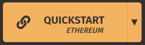
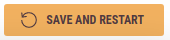
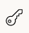

# Catalyst

### Catalyst is a blockchain-based marketplace catered to small, domestic goods manufacturers.

Being based on blockchain and having many additional well-thought-out features, it ensures review integrity, and enables small businesses to stand out in an ever-growing market.

# Running

The build process remains similar regardless of your operating system.

   1. Clone an up-to-date version of the `master` branch;
   2. Ensure the following dependencies have been installed:
      - `Flutter SDK`;
      - `Android SDK`;
      - `Ganache (GUI Client)`;
      - `nodejs`;
      - `npm`, as well as accompanying packages: `truffle ipfs-http-client ipfs-api multer`.
      
      > **Windows users:** In case the building fails, you may need to adjust your System Environment Variables.
      
      > **Linux users:** Some npm packages might need to be installed globally and with superuser privileges. Consult the installation manual of the respective package for full instructions.
      
   3. Connect your physical device via the `adb` utility, or launch an instance of the Android System Emulator. Whatever you choose, be sure to verify connectivity by typing `flutter devices` in the command line;
   4. Launch the Ganache GUI Client and create an empty workspace:
      
      
      > **Notice:** Your firewall might prevent Ganache from running properly. On Linux, use the `ufw` package to temporarily disable the firewall or add an exemption. If you are using Windows, you will be prompted to allow inbound and outbound traffic for needed ports.
   5. Open the Settings menu by clicking the gear icon in the upper right corner:
      
   6. Navigate to the Server tab:

         
      If you're using Windows, under the section `HOSTNAME` select an item having ` - WIFI` or ` - Ethernet` appended to your local address. On Linux, your network adapter name will be appended to the local address (` - wlp3s0` as shown above).  Do not use the default option.

      Take a note of the values `HOSTNAME` and `PORT NUMBER`, as you'll need them in just a bit.
   7. Confirm your choices by clicking the Save and Restart button:
      
   8. Once the client restarts, press the key icon next to a random address: 

      Copy the private key. Replace the value of the `PRIVATE_KEY` constant in the `src/frontend_mobile/lib/config.dart` file.

      Also, modify the `HOST` constant in the same file, by using the values from step 6 (e.g. `"192.168.1.7:7545"`).
   9. Lastly, modify the `src/frontend_mobile/truffle-config.js` file, replacing the `host` and `port` properties with appropriate values.
   10. Run `build.sh`. **This may take a while**.
   
